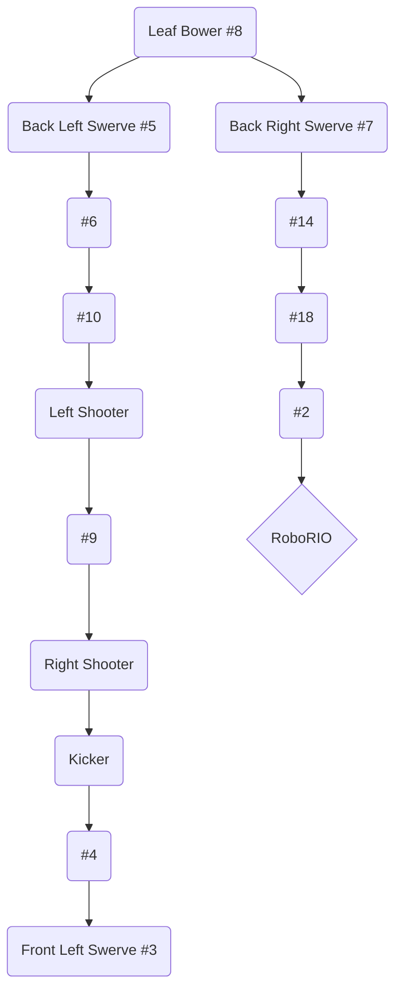

# FRC24 Crescendo Offseason

## 1745 CAN Wire Diagram (Unfinished)

```mermaid
graph TD;
    A(Leaf Bower #8)-->B;
    A-->5(Back Left Swerve #5);
    5-->6(#6);
    6-->10(#10);
    10-->LEFTSHOOTER(Left Shooter);
    LEFTSHOOTER-->9(#9);
    9-->RIGHTSHOOTER(Right Shooter);
    RIGHTSHOOTER-->KICKER(Kicker);
    KICKER-->4(#4);
    4-->3(Front Left Swerve #3);
    B(Back Right Swerve #7)-->D(#14);
    D-->E(#18);
    E-->F(#2);
    F-->G{RoboRIO};
```