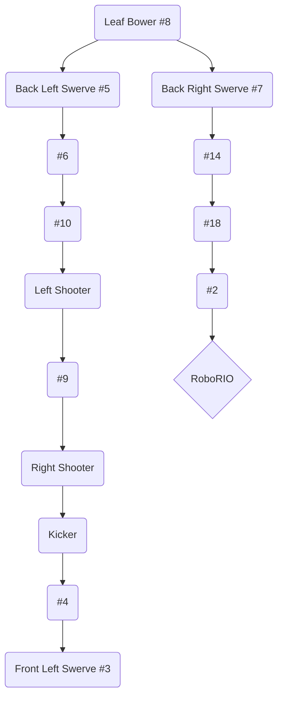

# MAXSwerve Java Template v2023.1

See [the online changelog](https://github.com/REVrobotics/MAXSwerve-Java-Template/blob/main/CHANGELOG.md) for information about updates to the template that may have been released since you created your project.

## Description

A template project for an FRC swerve drivetrain that uses REV MAXSwerve Modules.

Note that this is meant to be used with a drivetrain composed of four MAXSwerve Modules, each configured with two SPARKS MAX, a NEO as the driving motor, a NEO 550 as the turning motor, and a REV Through Bore Encoder as the absolute turning encoder.

To get started, make sure you have calibrated the zero offsets for the absolute encoders in the Hardware Client using the `Absolute Encoder` tab under the associated turning SPARK MAX devices.

## Prerequisites

* SPARK MAX Firmware v1.6.2 - Adds features that are required for swerve
* REVLib v2023.1.2 - Includes APIs for the new firmware features

## Configuration

It is possible that this project will not work for your robot right out of the box. Various things like the CAN IDs, PIDF gains, chassis configuration, etc. must be determined for your own robot!

These values can be adjusted in the `Constants.java` file.

## 1745 CAN Wire Diagram (Unfinished)
