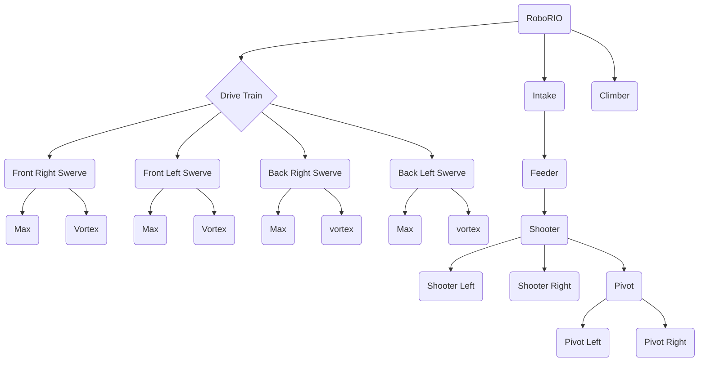

```mermaid
graph TD;
    A(RoboRIO)-->2;
    2{Drive Train};
    A-->B(Intake);
    e-->c(Shooter);
    c-->s(Shooter Left);
    c-->t(Shooter Right);
    A-->d(Climber);
    B-->e(Feeder);
    c-->f(Pivot);
    f-->u(Pivot Left)
    f-->v(Pivot Right)
    2-->g(Front Right Swerve);
    2-->h(Front Left Swerve);
    2-->i(Back Right Swerve);
    2-->j(Back Left Swerve);
    g-->k(Max);
    h-->l(Max);
    i-->m(Max);
    j-->n(Max);
    g-->o(Vortex);
    h-->p(Vortex);
    i-->q(vortex);
   j-->r(vortex);


```
