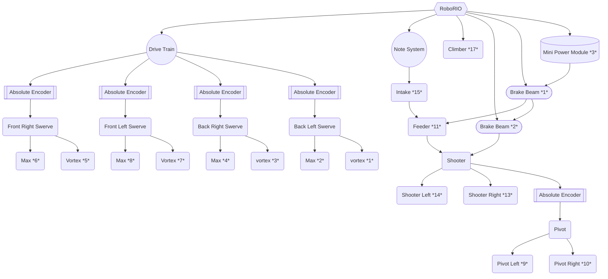

```mermaid
graph TD;
    A{{RoboRIO}}-->2;
    2((Drive Train));
    A-->3((Note System));
    3-->B(Intake *15*);
    e-->c(Shooter);
    c-->s(Shooter Left *14*);
    c-->t(Shooter Right *13*);
    A-->d(Climber *17*);
    B-->e(Feeder *11*);
    9-->f(Pivot);
    f-->u(Pivot Left *9*)
    f-->v(Pivot Right *10*)
    5-->g(Front Right Swerve);
    6-->h(Front Left Swerve);
    7-->i(Back Right Swerve);
    8-->j(Back Left Swerve);
    g-->k(Max *6*);
    h-->l(Max *8*);
    i-->m(Max *4*);
    j-->n(Max *2*);
    g-->o(Vortex *5*);
    h-->p(Vortex *7*);
    i-->q(vortex *3*);
    j-->r(vortex *1*);
    2-->5[[Absolute Encoder]];
    2-->6[[Absolute Encoder]];
    2-->7[[Absolute Encoder]];
    2-->8[[Absolute Encoder]];
    c-->9[[Absolute Encoder]];
    A-->11([Brake Beam *2*])-->c;
    A-->12([Brake Beam *1*])-->e;
    A-->15[(Mini Power Module *3*)]-->12-->11;

```
