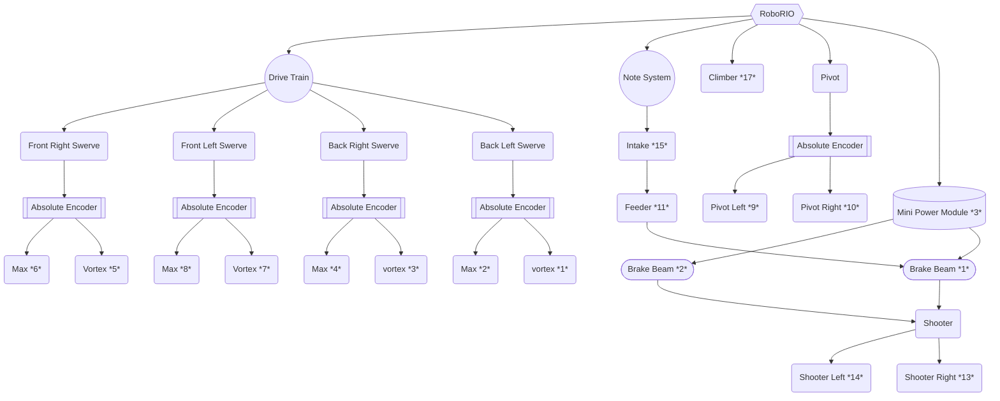

```mermaid
graph TD;
    A{{RoboRIO}}-->2;
    2((Drive Train));
    A-->3((Note System));
    3-->B(Intake *15*);
    12-->c(Shooter);
    c-->s(Shooter Left *14*);
    c-->t(Shooter Right *13*);
    A-->d(Climber *17*);
    B-->e(Feeder *11*);
    A-->f(Pivot);
    9-->u(Pivot Left *9*)
    9-->v(Pivot Right *10*)
    2-->g(Front Right Swerve);
    2-->h(Front Left Swerve);
    2-->i(Back Right Swerve);
    2-->j(Back Left Swerve);
    5-->k(Max *6*);
    6-->l(Max *8*);
    7-->m(Max *4*);
    8-->n(Max *2*);
    5-->o(Vortex *5*);
    6-->p(Vortex *7*);
    7-->q(vortex *3*);
    8-->r(vortex *1*);
    g-->5[[Absolute Encoder]];
    h-->6[[Absolute Encoder]];
    i-->7[[Absolute Encoder]];
    j-->8[[Absolute Encoder]];
    f-->9[[Absolute Encoder]];
    15-->11([Brake Beam *2*])-->c;
    e-->12([Brake Beam *1*]);
    A-->15[(Mini Power Module *3*)]-->12;

```
